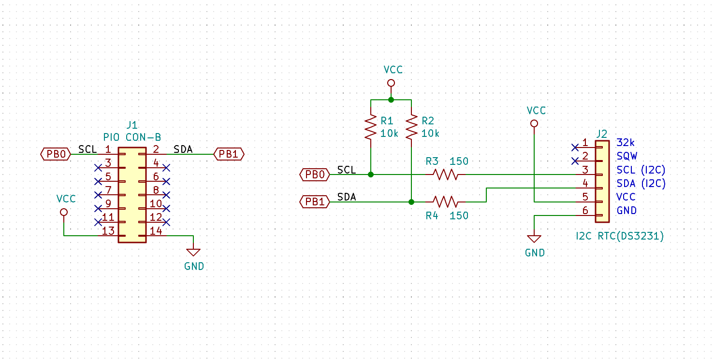
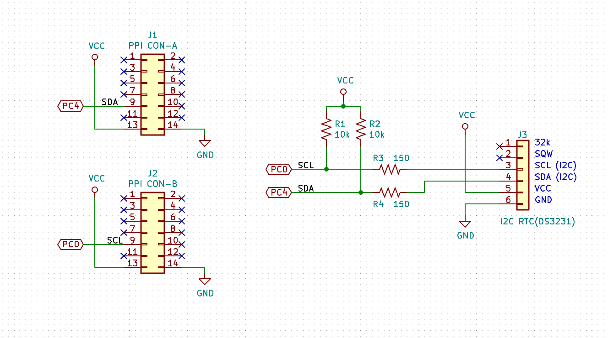

= KZ80-ZilogIOボード用サンプルプログラム =

== 概要 ==
* KZ80-ZilogIOボードに接続するサンプルです。

== Z80 PIOによるI2C RTC(DS3231)との通信 == 
* 概要
** Z80 PIOを使ってI2C RTC(DS3231)モジュールから日時データを読み出します。
* 接続回路
** 以下のように、Z80 PIOのB0、B1に抵抗器2本づつ接続してI2C RTCモジュールへつなぎます。

* プログラム
** I2C-RTC.ASM    : メイン
** Z80PIO_I2C.ASM : I2Cライブラリ
* アセンブリ 
** The Macroassembler AS用のビルドスクリプトを `build_I2C-RTC.sh` として添付しました
*** http://john.ccac.rwth-aachen.de:8000/as/
* 実行方法
** KZ80機械語モニターで　`G8000` で実行してください。
* 参考
** http://www.blunk-electronic.de//train-z/pdf/howto_program_I2C.pdf

== 8255PPIによるI2C RTC(DS3231)との通信 == 
* 概要
** 8255PPIを使ってI2C RTC(DS3231)モジュールから日時データを読み出します。(KZ80-IOBを使ってください)
* 接続回路
** 以下のように、8255PPIのPC0、PC41に抵抗器2本づつ接続してI2C RTCモジュールへつなぎます。

* プログラム
** I2C-RTC.ASM    : メイン
** PPI_I2C.ASM : I2Cライブラリ
* アセンブリ 
** The Macroassembler AS用のビルドスクリプトを `build_I2C-RTC.sh` として添付しました
*** http://john.ccac.rwth-aachen.de:8000/as/
* 実行方法
** KZ80機械語モニターで　`G8000` で実行してください。
